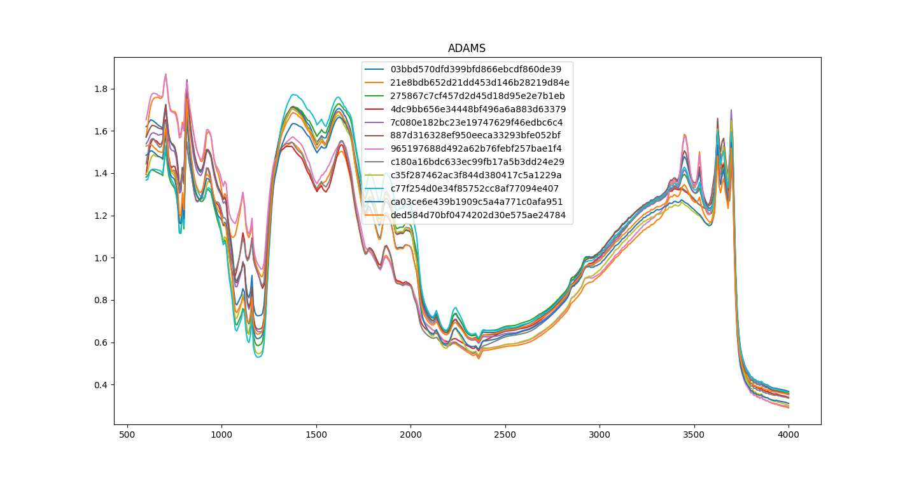

# Requirements

Requires the [spectral-data-converter-vis](https://github.com/waikato-datamining/spectral-data-converter-vis) module.


# Plugins

## Viewing spectra  

The following command loads spectra in ADAMS .spec format, down-samples them
(i.e., only leaves every nth wave number) and then displays the spectra:

```bash
sdc-convert -l INFO -b \
  from-adams \
    -l INFO \
    -i {CWD}/input/*.spec \
  downsample \
    -n 4 \
  view-spectra \
    --title ADAMS \
    --legend
```

The resulting plot looks something like this:


